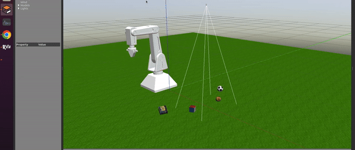
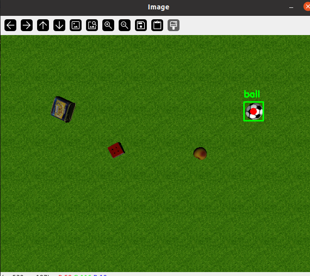

# Motion-Planning Robot in Gazebo with Camera

## Overview

This project involves a motion-planning robot simulated in the Gazebo environment. The robot is equipped with a camera that uses template matching to identify and locate specific objects within the environment. Once an object is identified, the robot navigates towards it.

### Usage Demo

1. **Final Result**  
   

2. **Object Detection**  
   


### Key Features
- **MoveIt Integration:** The project leverages the MoveIt Assistant for motion planning and control, ensuring smooth and efficient movements.
- **Motion Planning:** Once an object is recognized, the robot plans and executes a path to approach the object.
- **Command Interface:** Users can interact with the robot via a simple text prompt interface. For example, typing "rubik" will command the robot to locate and move towards a Rubik's cube.
- **Template Matching:** The robot's camera uses template matching to identify objects in the environment. 


## Setup

### Prerequisites
- [ROS (Robot Operating System)](http://www.ros.org/) installed.
- [Gazebo](http://gazebosim.org/) simulator.
- [MoveIt](https://moveit.ros.org/) installed and configured.
- Python 3.6+ or equivalent for running the command interface.
- OpenCV library for object detection

### Installation
1. Clone this repository:
    ```bash
    git clone https://github.com/TheEynEyn/arm_gazebo_with_camera.git
    cd arm_gazebo_with_camera
    ```
2. Install dependencies:
    Assume ROS Noetic and Gazebo 11 are already installed on your system.
    ```bash
    sudo apt install ros-noetic-moveit
    sudo apt install ros-noetic-rviz
    sudo apt-get install ros-noetic-ros-control ros-noetic-ros-controllers

    ```
3. add these lines to your .bashrc
    ```bash
    export GAZEBO_MODEL_PATH=~/ControlArm/src/robot_arm_urdf/models:${GAZEBO_MODEL_PATH}
    export GAZEBO_MODEL_PATH=~/ControlArm/src/robot_arm_urdf/worlds:${GAZEBO_MODEL_PATH}


    ```
4. Build the ROS workspace:
    ```bash
    catkin_make
    source devel/setup.bash
    ```

## Usage

1. **Launch the Gazebo simulation:**
    ```bash
    roslaunch arm6 full_RvizGazebo.launch
    ```
2. **Run the command interface for 'vision' package:**
    ```bash
    rosrun vision detection_ros.py
    ```

3. **After that, run the following command to move the robot to the desired object:**
    ```bash
    rosrun arm6 node_set_predefined.py
    ```
4. **Send a command (name of object):**
   - Type the name of the object you want the robot to locate, including `rubik`,`can`,`peach` and `ball` and press Enter.
   - The robot will identify the object using template matching, plan a path, and move towards it.

## Customization

- **Template Matching:** The cropped template images used for object recognition can be found `../src/vision/cropped_image`. You can modify or replace these images to recognize different objects.
- **Motion Planning:** Adjust the motion planning parameters in the MoveIt configuration files to tweak the robot's movement behavior. 
- **Object Positions:** You can change the positions of the objects within the simulation by editing the world.sdf file. This file contains the definitions for the objects in the Gazebo world, allowing you to adjust their initial placement as needed.

## Contributing

Contributions are welcome! Please open an issue or submit a pull request for any improvements or new features.


## Authors

- [Armin Attarzadeh](https://github.com/ArminAttarzadeh)  
- [Kianoush Abbaslou](https://github.com/Jeremy-capdevilla)
- Spring 2024
